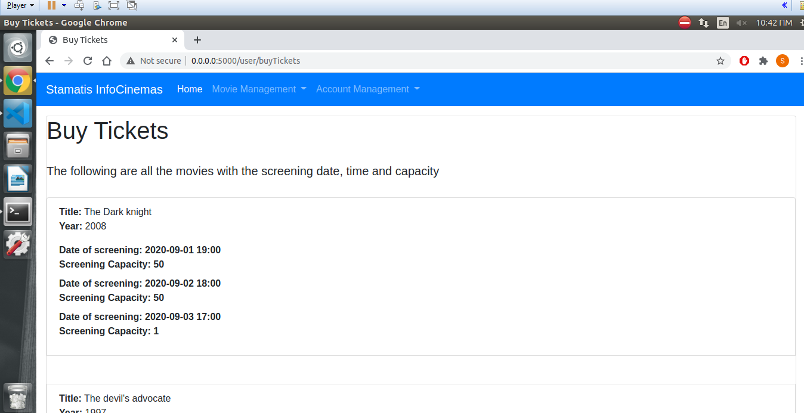

# InfoCinemas2020_E17113_ORFANOS_STAMATIOS
Εργασία του μαθήματος "Πληροφοριακά Συστήματα"

Φοιτητής: **Σταμάτιος Ορφανός (Ε17113)**

## Περιεχόμενα
* [Περιγραφή Πληροφοριακού Συστήματος](#Περιγραφή-Πληροφοριακού-Συστήματος)
* [Βοήθεια Εκτέλεσης του Προγράμματος](#Βοήθεια-Εκτέλεσης-του-Προγράμματος)
* [Λειτουργίες Πληροφοριακού Συστήματος](#Λειτουργίες-Πληροφοριακού-Συστήματος)
	* [Σελίδα σύνδεσης](#Σελίδα-σύνδεσης)
	* [Σελίδα εγγραφής](#Σελίδα-εγγραφής)
  * [Σελίδα λογαριασμού](#Σελίδα-λογαριασμού)
	* [Σελίδα πληροφοριών χρήστη](#Σελίδα-Πληροφοριών-Χρήστη)
  * [Σελίδα απεγγραφής](#Σελίδα-αποσύνδεσης)
	* [Αρχική σελίδα Admin](#Αρχική-σελίδα-Admin)
  * [Σελίδα διαχείρισης ταινίας Admin](#Σελίδα-διαχείρισης-ταινίας-Admin)
	* [Σελίδα εισαγωγής ταινίας](#Σελίδα-Εισαγωγής-Ταινίας)
	* [Σελίδα αναζήτησης ταινίας](#Σελίδα-Αναζήτησης-Ταινίας)
	* [Σελίδα ενημέρωσης ταινίας](#Σελίδα-Ενημέρωσης-Ταινίας)
	* [Σελίδα διαγραφής ταινίας](#Σελίδα-Διαγραφής-Ταινίας)
	* [Σελίδα διαχείρισης χρηστών Admin](#Σελίδα-διαχείρισης-χρηστών-Admin)
	* [Αρχική σελίδα User](#Αρχική-σελίδα-User)
	* [Σελίδα διαχείρισης ταινίας User](#Σελίδα-διαχείρισης-ταινίας-User)
	* [Σελίδα αναζήτησης ταινίας User](#Σελίδα-Αναζήτησης-Ταινίας-User)
	* [Σελίδα αγοράς εισητηρίων ταινίας](#Σελίδα-Αγοράς-Εισητηρίων-Ταινίας)
	* [Σελίδα ιστορικού ταινιών](#Σελίδα-Ιστορικού-Ταινιών)

## Περιγραφή πληροφοριακού συστήματος
Το πληφοριακό σύστημα στο οποιό είναι χτισμένο το InfoCinemas χρησιμοποιεί τις τεχνολογίες Flask, MongoDB και Docker. Πιο συγκεκριμένα, βασίζεται σε ένα ζευγάρι από containers όπου περιλαμβάνουν την βάση δεδομένων και την web εφαρμογή.

### Βάση δεδομένων
Η βάση δεδομένων MongoDB ακολουθεί αυτή την δομή:

InfoCinemas Database περιλαμβάνει δυο collections User / Movie (collections):

User Collection:
| name | email | password | movies_seen| category |
|------|-------|----------|------------|----------|
|string|string | string   | list       | string   |

Movie Collection:
| title | year | description | screening.date | screening.capacity |
|-------|------|-------------|----------------|--------------------|
|string |integer| string     | Datetime       | integer            |


## Βοήθεια Εκτέλεσης  του Προγράμματος
Για την εκτέλεση του προγράμματος στον υπολογιστή σας χρειάζεται να πάτε στον φάκελο InfoCinemas2020_E17113_ORFANOS_STAMATIOS και να εκτελέσετε την εντολή:

```bash
sudo docker-compose up --build
```

Σε περίπτωση που δεν υπάρχει η βάση 'InfοCinemas' στην mongodb μαζί με τα αντίστοιχα collections, το πρόγραμμα θα φορτώσει τα αρχεία JSON και θα την δημιουργήσει αυτόματα.

## Λειτουργίες Πληροφοριακού Συστήματος

### Σελίδα σύνδεσης
Η πρώτη σελίδα που θα δει ο χρήστης είναι η sign-in σελίδα με την οποία ένας χρήστης μπορεί να μπει 
στην ιστοσελίδα με τον ρόλο που έχει είτε ως Admin είτε ως User. Στο κάτω μέρος της καρτέλας υπάρχει το link
για την σελίδα sign-up σε περίπτωση που νέος χρήστης θέλει να έχει πρόσβαση στην ιστοσελίδα.

Στην εργασία υπάρχουν ένα json file με το όνομα users.json το οποίο περιέχει τους users που μπορεί κανείς να 
χρησιμοποιήσει αρχικά.


### Σελίδα εγγραφής
Στη σελίδα εγγραφής ένας χρήστης έχει την δυνατότητα να κάνει εγγραφή και να είναι πλέον ένας χρήστης του συστήματος. Προφανώς όταν ένας χρήστης κάνει εγγραφή θα έχει το ρόλο User και όχι Admin, καθώς ο αρχικός Admin του συστήματος θα έχει μόνο την δυνατότητα να μετατρέπει τον User σε Admin. 
Ο νέος χρήστης θα πρέπει να εισάγει ένα username, το email και τον κωδικό για τον λογαριασμό του. 

Σημείωση:μέσω όλων των templates γίνεται έλεγχος για την εισαγωγή σωστών δεδομένων, όπως εισαγωγή valid format e-mail και άλλα.


### Σελίδα λογαριασμού
Η σελίδα λογαριασμού περιλαμβάνει τα links για τις σελίδες sign-in, sign-out, και userInformation. Οι παραπάνω σελίδες είναι κοινές τόσο για τους Users όσο και για τους Admin. 


### Σελίδα πληροφοριών χρήστη
Η σελίδα πληροφοριών χρήστη περιλαμβάνει πληροφορίες όπως το email του χρήστη, καθώς και η κατηγορία του στο σύστημα, δηλαδή User ή Admin.


### Σελίδα αποσύνδεσης
Η σελίδα αποσύνδεσης παρέχει πληρόφορίες για τον χρήστη πριν κάνει sign-out.


### Αρχική σελίδα Admin
Στην αρχική σελίδα του admin έχουμε την μπάρα με τις άλλες σελίδες που μπορεί να χρησιμοποιήσει ο Admin.


### Σελίδα διαχείρισης ταινίας Admin
Σε αυτή τη περίπτωση έχουμε τις εξής δυνατότητες:
1.Εισαγωγή νέας ταινίας 
2.Αναζήτηση υπάρχουσας ταινίας
3.Ενημέρωση υπάρχουσας ταινίας
4.Διαγραφή υπάρχουσας ταινίας


### Σελίδα εισαγωγής ταινίας 
Σε αυτή τη σελίδα ένας Admin μπορεί να εισάγει τον τίτλο, την χρονιά, την περιγραφή και τις πληροφορίες screening όπως η ημερομηνία, ώρα και ο αριθμός θέσεων που είναι διαθέσιμος, έτσι ώστε να εισάγουμε μια νέα ταινία στην βάση δεδομένων.


### Σελίδα αναζήτησης ταινίας
Σε αυτή τη σελίδα ένας Admin μπορεί να εισάγει τον τίτλο μιας ταινίας ή να εισάγει ένα 
pattern που μοιάζει με τον τίτλο της ταινίας και θα μας μεταφέρει σε μια νέα σελίδα με όλες τις πληροφορίες αυτή της ταινίας. 


### Σελίδα ενημέρωσης ταινίας 
Σε αυτή τη σελίδα ένας Admin μπορεί να εισάγει τον τίτλο, την χρονιά, την περιγραφή και τις πληροφορίες screening όπως η ημερομηνία, ώρα και ο αριθμός θέσεων που είναι διαθέσιμος, έτσι ώστε να ενημερώσουμε μια υπάρχουσα ταινία στην βάση δεδομένων. Φυσικά ο χρήστης μπορεί να εισάγει όσα δεδομένα για την ενημέρωση θέλει και τα υπόλοιπα δεδομένα θα παραμείνουν όπως ήταν αρχικά. 


### Σελίδα διαγραφής ταινίας
Σε αυτή τη σελίδα ένας Admin μπορεί να εισάγει τον τίτλο μιας ταινίας με στόχο να την διαγράψει από την βάση δεδομένων. Για την βοήθεια του χρήστη υπάρχουν οι τίτλοι όλων των ταινιών στη σελίδα διαγραφής.


### Σελίδα διαχείρισης χρηστών Admin 
Σε αυτή τη σελίδα ένας Admin μπορεί να εισάγει το email , την χρονιά, την περιγραφή και τις πληροφορίες screening όπως η ημερομηνία, ώρα και ο αριθμός θέσεων που είναι διαθέσιμος, έτσι ώστε να ενημερώσουμε μια υπάρχουσα ταινία στην βάση δεδομένων. Φυσικά ο χρήστης μπορεί να εισάγει όσα δεδομένα για την ενημέρωση θέλει και τα υπόλοιπα δεδομένα θα παραμείνουν όπως ήταν αρχικά. 


### Αρχική σελίδα User
Η παρακάτω είναι η αρχική σελίδα user στην οποία μπορεί ένας User να περιηγηθεί.


### Σελίδα διαχείρισης ταινίας User
Σε αυτή τη σελίδα ο User έχει την δυνατότητα να εκτελέσει τις παρακάτω λειτουργίες:
1.Αναζήτηση υπάρχουσας ταινίας (είναι η ίδια διαδικασία με αυτή του Admin χρήστη) 
2.Αγορά εισητηρίων για μια υπάρχουσα ταινία
3.Ιστορικό ταινιών 


### Σελίδα αγοράς εισητηρίων ταινίας
Σε αυτή τη σελίδα ο User μπορεί να εισάγει τον τίτλο, τη χρονιά και την ημερομηνία και ώρα έτσι ώστε να επιλέξει την κατάλληλη προβολή. Στην συνέχεια επιλέγει τον αριθμό εισητηρίων που θέλει να αγοράσει και πατάει το κουμπί Buy Tickets.
Επίσης η σελίδα περιλαμβάνει αναλυτικά όλες τις ταινίες και τις προβολές και τον αριθμό διαθέσιμων θέσεων για την διευκόλυνση του User.





### Σελίδα ιστορικού ταινιών
Η σελίδα ιστορικού εμφανίζει τους τίτλους ταινιών που έχει παρακολουθήσει ο User, ή ουσιαστικά τους τίτλους ταινιών για τους οποίους έχει αγοράσει εισητήρια.


